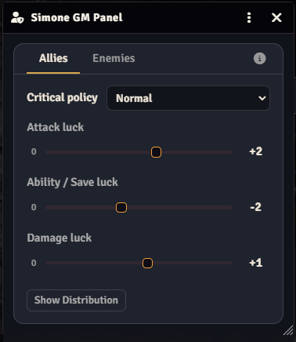
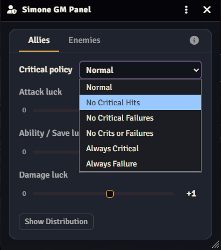

# Simone GM Panel Luck

Luck controls and dnd5e roll automation for Simone GM Panel.

## Preview

<table>
  <tr>
    <td align="center"></td>
    <td align="center"></td>
  </tr>
  <tr>
    <td align="center"><strong>Luck controls</strong></td>
    <td align="center"><strong>Critical hit policy</strong></td>
  </tr>
</table>

## Requirements

- Simone GM Panel Core (`simone-gm-panel`) 1.0.0 or newer.
- dnd5e 5.3.3 or newer.

## Features

- Per-faction luck controls for attacks, damage, abilities, and saves.
- Critical success/failure policy controls.
- Session-safe cooperative DiceTerm wrapper and dnd5e hooks.

## Installation

Install from the Foundry VTT **Add-on Modules** screen using the manifest URL from the latest GitHub release.

## Compatibility

- Foundry Virtual Tabletop 14
- Version: 1.0.0

## Support

Report reproducible issues through this repository's GitHub Issues page. Include the Foundry version, active system version, enabled GM Panel packages, and relevant console errors.

## License

Copyright (c) 2026 Simone Bianco. All rights reserved. See `LICENSE`.
